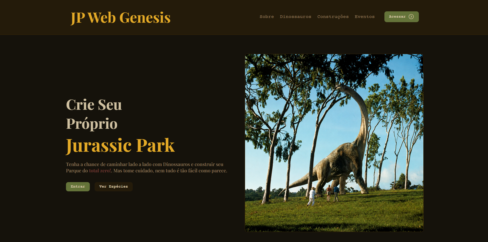
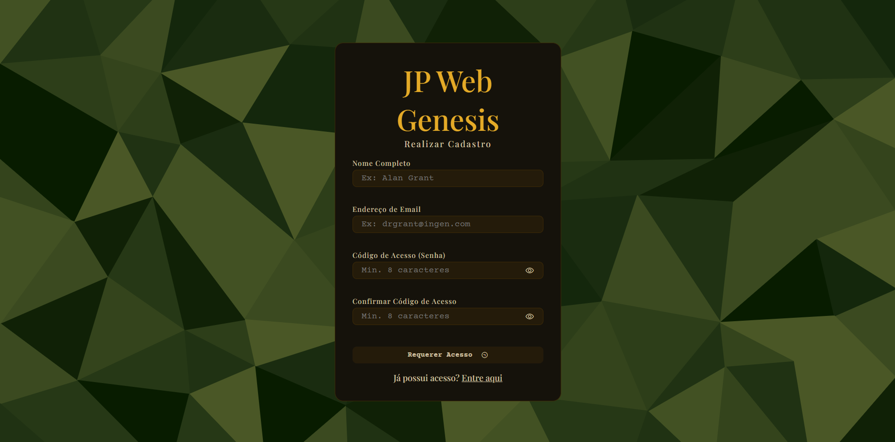
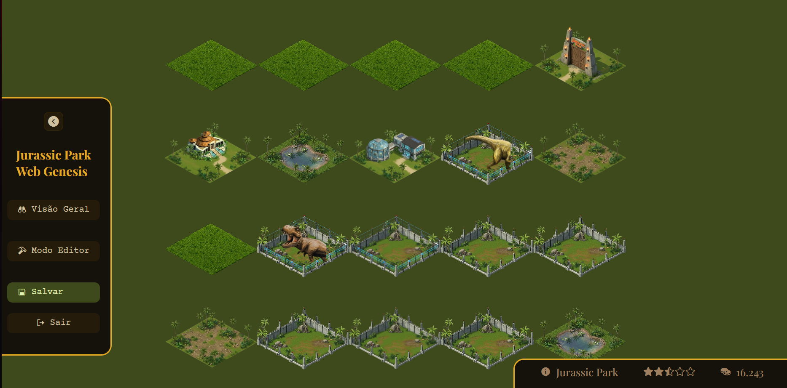
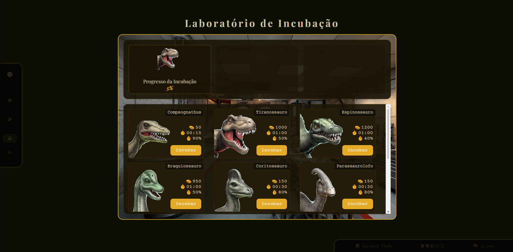
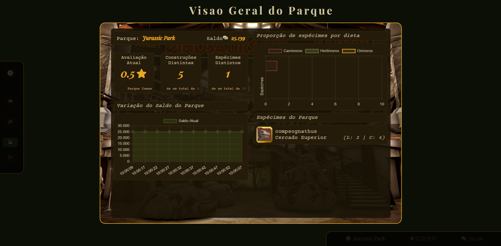
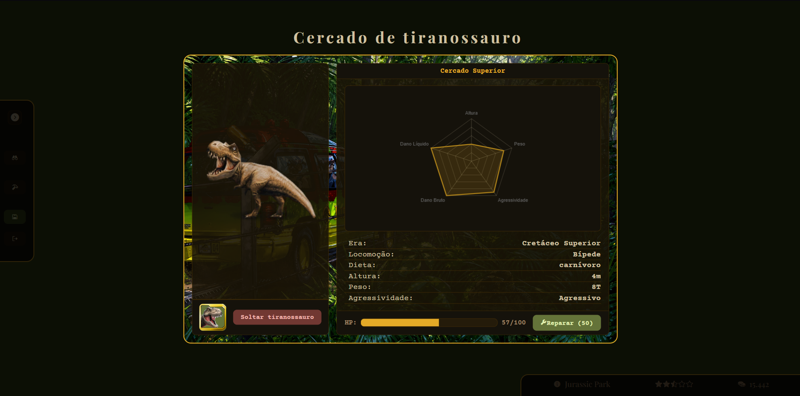

# 🦖 Jurassic Park: Web Genesis | PI 2026.1

<div align="center">
    

Este projeto diz respeito ao **Projeto Individual** desenvolvido por Arthur Rocha Rosante durante o **1° Semestre de 2026** na SPTech.

</div>

## 🌐 Tech Stack do Projeto

### Front-end
[](https://skillicons.dev)

### Back-end
[](https://skillicons.dev)

## 🦕 Demonstração - Telas
<div align="center">
    <h2>Landing Page</h2>
    
    <h2>Cadastro/Login</h2>
    
    <h2>Parque - Tela Principal</h2>
    
    <h2>Parque - Incubadora</h2>
    
    <h2>Parque - Centro de Visitantes</h2>
    
    <h2>Parque - Cercado</h2>
    
</div>

## 📦 Guia de Instalação

Siga os passos abaixo para configurar e executar o projeto localmente.

### 1. Pré-requisitos

Certifique-se de possuir os seguintes softwares instalados e configurados em sua máquina:

[](https://skillicons.dev)

---

### 2. Configuração do Banco de Dados

Execute o script SQL localizado no caminho abaixo para criar e configurar o banco de dados:

```bash
web-data-viz/src/database/script-tabelas.sql
```

---

### 3. Instalação das Dependências

No terminal, execute o comando abaixo para instalar todos os pacotes do projeto:

```bash
cd .\web-data-viz\

npm i
```

---

### 4. Configuração das Variáveis de Ambiente

Crie um arquivo `.env` e outro `.env.dev` na raiz do projeto utilizando o `.env.example` na raíz do projeto como template.

Exemplo:

```bash
# desenvolvimento | producao
AMBIENTE_PROCESSO=""

# Configurações de conexão com o banco de dados
DB_HOST=localhost
DB_DATABASE='database_name'
DB_USER='database_user'
DB_PASSWORD='database_password'
# 3306 - MySQL Local | 3307 - MySQL | VM Lubuntu
DB_PORT=3306

# Configurações do servidor de aplicação
APP_PORT=3333
APP_HOST=localhost
```

Depois, preencha as variáveis de ambiente com suas próprias credenciais.

---

### 5. Executando o Projeto

Para iniciar a aplicação, abra o terminal e execute o comando abaixo:

```bash
npm start
```

### 6. Acessando o Jogo

Se você seguiu o passo a passo de forma correta, então sua aplicação deve estar rodando no endereço: http://localhost:3333